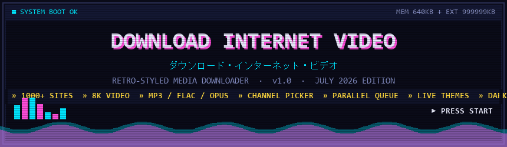
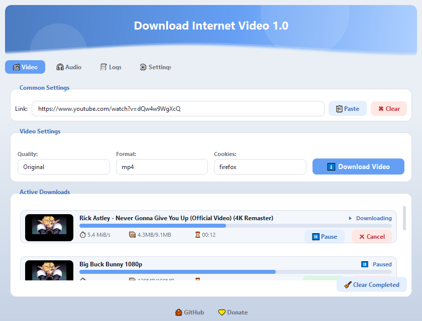
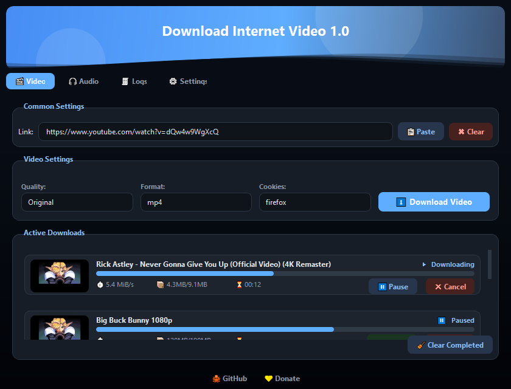
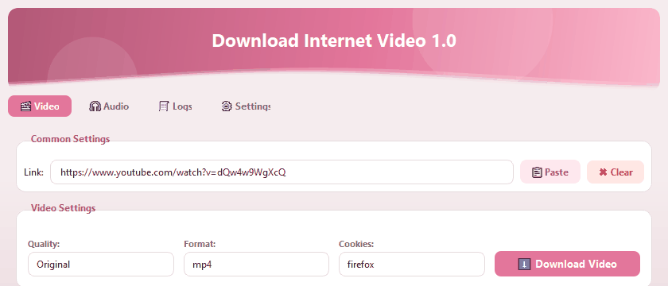
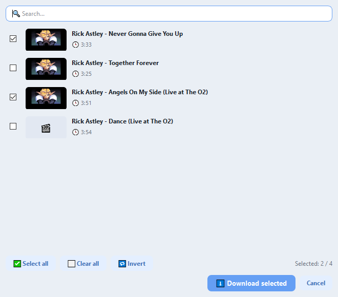

<!-- ╔══════════════════════════════════════════════════════════════╗ -->
<!--            DOWNLOAD INTERNET VIDEO · PC-98 EDITION              -->
<!-- ╚══════════════════════════════════════════════════════════════╝ -->

<div align="center">



<br>

[](#)
[](https://www.python.org/)
[](https://github.com/yt-dlp/yt-dlp)
[](LICENSE)

### ▚▚▚  INSERT DISK 1 · PRESS START  ▚▚▚

**A retro-styled, out-of-the-box video & audio downloader for 1000+ sites.**
No setup, no dependencies to chase — drop the folder on any PC and run.

</div>

```
┌──────────────────────────────────────────────────────────────────────┐
│  > PASTE LINK ............ any video, channel or playlist              │
│  > PICK FORMAT ........... MP4 · WEBM · MKV  /  MP3 · FLAC · OPUS      │
│  > PRESS DOWNLOAD ........ queue it, theme it, done.                   │
└──────────────────────────────────────────────────────────────────────┘
```

---

## ◆ SCREENS

<div align="center">

|  ☀ LIGHT MODE  |  ☾ DARK MODE  |
|:--------------:|:-------------:|
|  |  |

</div>

Site-style **animated wave banner**, one-line settings, thumbnail preview cards
with live speed / size / ETA, and a tab bar that "splashes" the waves on switch.

---

## ◆ LIVE THEMING · CHANGE COLORS IN REAL TIME

<div align="center">



</div>

Drag the **hue slider** (0–360) and the entire app recolors instantly using the
`oklch` color model — buttons, tabs, cards, progress bars and waves. Add a
**saturation** dial, a **Light / Dark / System** switch, and a full
**color picker with a screen eyedropper**.

---

## ◆ CHANNEL & PLAYLIST PICKER

<div align="center">



</div>

Paste a **channel or playlist** URL and a picker pops up with every video —
**thumbnails, titles and durations**. Search, `Select all` / `Clear all` /
`Invert`, tick the ones you want, and they all drop into the download queue.

---

## ◆ FEATURES · FULL ROSTER

```
╔═══════════════════════════════════════════════════════════════════════╗
║  DOWNLOADER                                                           ║
╟───────────────────────────────────────────────────────────────────────╢
║  ▸ 1000+ sites .......... YouTube · TikTok · Instagram · VK · X · etc. ║
║  ▸ Channels/playlists ... checkbox picker with thumbs + search        ║
║  ▸ Download queue ....... sequential OR parallel (2–10 at once)       ║
║  ▸ Duplicate guard ...... replace · save a copy · or cancel           ║
║  ▸ Cookies .............. from any browser OR a cookies.txt file      ║
╠═══════════════════════════════════════════════════════════════════════╣
║  MEDIA                                                                 ║
╟───────────────────────────────────────────────────────────────────────╢
║  ▸ Video ................ MP4 · WEBM · MKV · AVI · MOV · FLV          ║
║  ▸ Audio ................ MP3 · M4A · WAV · AAC · FLAC · OPUS · VORBIS ║
║  ▸ Resolution ........... 144p → 8K (4320p)                           ║
║  ▸ Smart convert ........ keeps native container when possible;       ║
║                           FFmpeg tuned for small, high-quality files  ║
╠═══════════════════════════════════════════════════════════════════════╣
║  LOOK & FEEL                                                           ║
╟───────────────────────────────────────────────────────────────────────╢
║  ▸ Live hue + saturation sliders, advanced color picker               ║
║  ▸ Light / Dark / System modes                                        ║
║  ▸ Animated wave banner + collapsible settings sections               ║
║  ▸ 10 languages: EN · RU · ES · FR · DE · ZH · PT · AR · HI · JA      ║
╠═══════════════════════════════════════════════════════════════════════╣
║  ENGINE                                                                ║
╟───────────────────────────────────────────────────────────────────────╢
║  ▸ Bundled Deno runtime solves YouTube JS challenges out of the box   ║
║  ▸ Self-updating tools: yt-dlp / FFmpeg / Deno, atomic & rollback-safe║
║  ▸ Lazy startup — window opens in a blink, engine warms up in the bg  ║
╚═══════════════════════════════════════════════════════════════════════╝
```

---

## ◆ BOOT SEQUENCE · RUN FROM SOURCE

```console
$ pip install PyQt5 "yt-dlp[default]"
$ python main.py

  [ OK ] loading interface .................. done
  [ ?? ] checking runtime tools ............. FFmpeg / yt-dlp / Deno
  [ >> ] one-click auto-download if missing . into  runtime/
  [ OK ] ready. paste a link and PRESS START.
```

> On first launch, any missing tool (FFmpeg, yt-dlp, Deno) is downloaded
> automatically into the `runtime/` folder. Nothing else to install — ever.

## ◆ BUILD PORTABLE · MAKE YOUR OWN CARTRIDGE

```console
$ pip install pyinstaller pillow
$ python build_release.py
```

Outputs two ready-to-run builds in `dist/` — copy to any PC, no install:

| CARTRIDGE | WHAT | STARTUP |
|-----------|------|---------|
| 📁 **Portable folder** | app + `runtime/` tools beside it | instant |
| 📦 **Single EXE** | everything sealed in one file | slower (self-extracts) |

---

## ◆ MEMORY MAP · REPO LAYOUT

```
main.py            > entry point, theme + palette bootstrap
config.py          > paths, oklch theme engine, settings
core/              > download worker, playlist prober, tool checks
ui/                > main window, wave banner, download cards, dialogs
tools/             > tool installer / updater, network helpers
locales/           > 10 UI translations
docs/              > readme art
old/               > previous versions of the source
```

> Binaries (FFmpeg, Deno, yt-dlp.exe) and builds are **not** stored in git —
> the app fetches them on first run, keeping the repo tiny.

---

<div align="center">

### ▚▚▚  GAME OVER?  NO — CONTINUE ▸ ▸ ▸  ▚▚▚

Made with 🕹 &nbsp;·&nbsp; Powered by [yt-dlp](https://github.com/yt-dlp/yt-dlp) · [FFmpeg](https://ffmpeg.org/) · [Deno](https://deno.com/) · [PyQt5](https://riverbankcomputing.com/software/pyqt/)

[](https://github.com/bboyJohnn/Download-Internet-Video)

</div>
